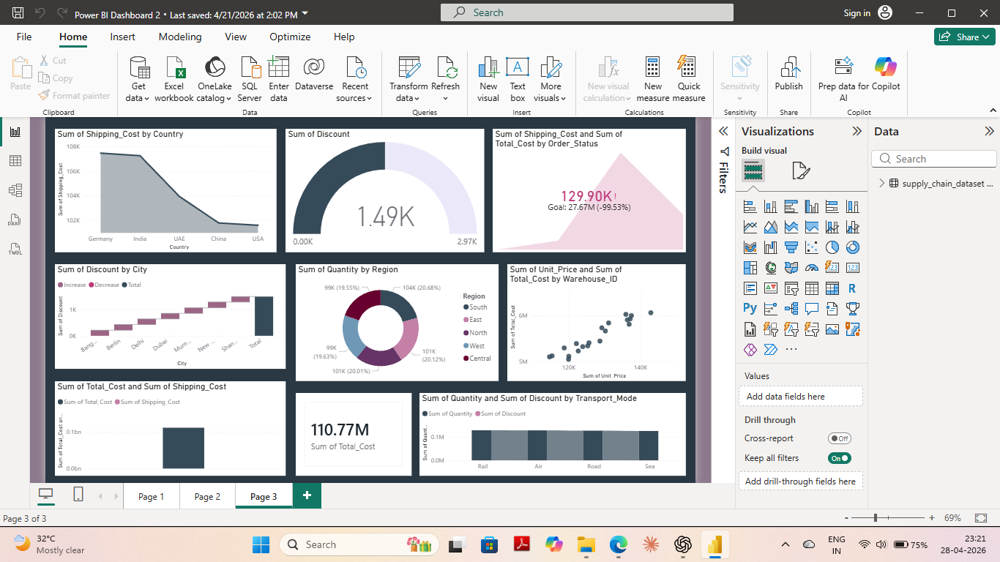
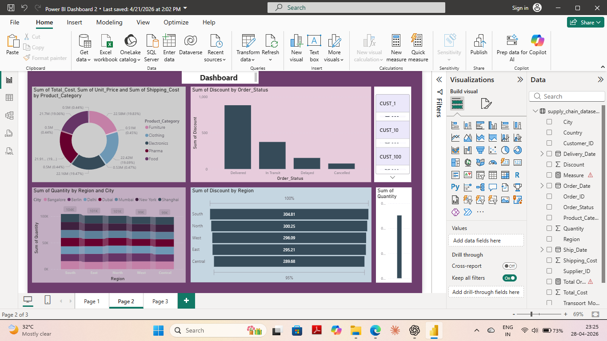

# 📊 Supply Chain Performance Dashboard (Power BI)

## 📊 Overview
This project presents an interactive Power BI dashboard to analyze supply chain and logistics performance.

## 🎯 Objectives
- Monitor delivery efficiency 🚚  
- Analyze shipment delays ⏱️  
- Evaluate operational performance 📊  

## 📊 Features
- KPI cards (Orders, Delays, Performance)  
- Region-wise insights  
- Trend analysis  
- Interactive filters  

## 🛠 Tools Used
- Power BI  
- Data Modeling  
- DAX  

## 🖼 Dashboard Preview

## 📂 Project File
🔽 [Download Dashboard](operations-analytics-dashboard.pbix)

## 📈 Key Insights
- Identified delay trends across regions  
- Observed performance variations  
- Improved visibility of operations  

## 👩‍💻 Author

Shambhavi Tripathi

https://www.linkedin.com/in/shambhavi-tripathi-94bb9937a

https://github.com/shambhavi04august-hub

Logistics Professional 🚚 | Tech Enthusiast 💻 | Data-Driven 📊
